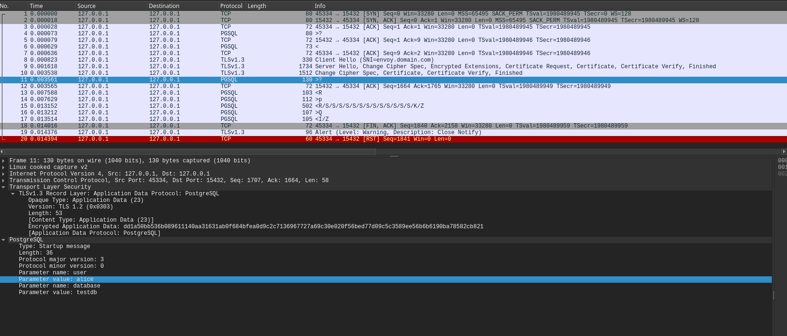

## Envoy Postgres Proxy Filter with TLS

Simple demo for using [Envoy PostgresProxy Filter](https://www.envoyproxy.io/docs/envoy/latest/configuration/listeners/network_filters/postgres_proxy_filter#postgres-proxy) with TLS.

basically:

`client` --> `mTLS`  --> `envoy:15432` --> `mTLS` --> `postgres:5432`

so..




The reason i wrote this up is i was trying to see if can substitute [Cloud SQL Proxy](https://cloud.google.com/sql/docs/postgres/sql-proxy#how-works) with envoy an in the course of writing it, i figured out this wasn't well documented...

---


### Setup.

The first step is to get an envoy version which supports the Postgres filter contribution.

```bash
docker cp `docker create envoyproxy/envoy:contrib-dev`:/usr/local/bin/envoy /tmp/
```

Then we will run postgres configured for mTLS:

```bash
# build a local docker container with the sample postgres config
## see pg_hba.conf
docker build -t postgresserver .

docker run -ti  -v `pwd`/certs:/certs/  \
  -e POSTGRES_PASSWORD=mysecretpassword -p 5432:5432 \
   postgresserver /usr/local/bin/docker-entrypoint.sh postgres \
    --port=5432 --ssl=on \
     --ssl_cert_file=/config/postgres.crt \
      --ssl_key_file=/config/postgres.key \
       --ssl_ca_file=/config/root-ca.crt \
        --hba_file=/config/pg_hba.conf
```

Once postgress is running, we need to connect and setup some test tables:

```bash
PGPASSWORD=mysecretpassword psql "sslmode=verify-ca \
  sslrootcert=certs/root-ca.crt sslcert=certs/pg-client.crt \
   sslkey=certs/pg-client.key hostaddr=127.0.0.1 \
    port=5432 user=postgres dbname=postgres"
```


```sql
CREATE USER alice WITH ENCRYPTED PASSWORD 'somepassword';
CREATE USER envoyclient WITH ENCRYPTED PASSWORD 'somepassword';
CREATE DATABASE testdb;

\connect testdb

CREATE TABLE accounts (
  user_id SERIAL PRIMARY KEY, 
  username VARCHAR (50) UNIQUE NOT NULL
);

INSERT INTO accounts (user_id, username) VALUES(123456,'PostgreSQL Tutorial');

select * from accounts;

GRANT ALL PRIVILEGES ON DATABASE testdb TO alice;
GRANT ALL PRIVILEGES ON accounts TO alice;
```

Now get an envoy contribution version which supports postgres filter:

```bash
docker cp `docker create envoyproxy/envoy:contrib-dev`:/usr/local/bin/envoy /tmp/

### now run envoy
cd envoy/
/tmp/envoy -c postgres.yaml -l trace
```

The specific filter entry uses `StartTLS`

- for downstream:

```yaml
static_resources:
  listeners:
  - name: postgres_listener
    address:
      socket_address:
        address: 0.0.0.0
        port_value: 15432
    filter_chains:
    - filters:
      - name: envoy.filters.network.postgres_proxy
        typed_config:
          "@type": type.googleapis.com/envoy.extensions.filters.network.postgres_proxy.v3alpha.PostgresProxy
          stat_prefix: egress_postgres
          enable_sql_parsing: true
          terminate_ssl: true
          upstream_ssl: REQUIRE
      - name: envoy.filters.network.tcp_proxy
        typed_config:
          "@type": type.googleapis.com/envoy.extensions.filters.network.tcp_proxy.v3.TcpProxy
          stat_prefix: postgres_tcp
          cluster: postgres_cluster

      transport_socket:
        name: "starttls"
        typed_config:
          "@type": type.googleapis.com/envoy.extensions.transport_sockets.starttls.v3.StartTlsConfig
          tls_socket_config:
            require_client_certificate: true
            common_tls_context:
              validation_context:
                trusted_ca:
                  filename: "certs/root-ca.crt"
              tls_certificates:
                certificate_chain:
                  filename: "certs/envoy.crt"
                private_key:
                  filename: "certs/envoy.key"
```

for upstrem:

```yaml
  clusters:
  - name: postgres_cluster
    connect_timeout: 1s
    type: strict_dns
    load_assignment:
      cluster_name: postgres_cluster
      endpoints:
      - lb_endpoints:
        - endpoint:
            address:
              socket_address:
                address: 127.0.0.1
                port_value: 5432
    transport_socket:
      name: envoy.transport_sockets.starttls
      typed_config:
        "@type": type.googleapis.com/envoy.extensions.transport_sockets.starttls.v3.UpstreamStartTlsConfig
        cleartext_socket_config: {}
        tls_socket_config:
          allow_renegotiation: true
          sni: "postgres.domain.com"
          common_tls_context:
            validation_context:
              match_typed_subject_alt_names:
              - san_type: DNS
                matcher:
                  exact: "postgres.domain.com"
              trusted_ca:
                filename: "certs/root-ca.crt"

            tls_certificates:
            - certificate_chain:
                filename: certs/envoyclient.crt
              private_key:
                filename: certs/envoyclient.key

```

Now connect using alice's certificate to envoy and issue a query

```bash
PGPASSWORD=somepassword psql "sslmode=verify-ca \
 sslrootcert=certs/root-ca.crt \
  sslcert=certs/alice.crt sslkey=certs/alice.key \
   hostaddr=127.0.0.1 port=15432 user=alice dbname=testdb"
```

Envoy logs will show the connection and query interception

```log
[2024-05-19 07:37:57.794][1071501][debug][main] [source/server/server.cc:241] flushing stats
[2024-05-19 07:37:57.794][1071501][debug][dns] [source/extensions/network/dns_resolver/cares/dns_impl.cc:377] dns resolution for 127.0.0.1 started
[2024-05-19 07:37:57.795][1071501][debug][dns] [source/extensions/network/dns_resolver/cares/dns_impl.cc:299] dns resolution for 127.0.0.1 completed with status 0
[2024-05-19 07:37:57.795][1071501][debug][upstream] [source/common/upstream/upstream_impl.cc:462] transport socket match, socket default selected for host with address 127.0.0.1:5432
[2024-05-19 07:37:57.795][1071501][debug][upstream] [source/extensions/clusters/strict_dns/strict_dns_cluster.cc:177] DNS refresh rate reset for 127.0.0.1, refresh rate 5000 ms
[2024-05-19 07:37:58.089][1071508][debug][filter] [source/common/tcp_proxy/tcp_proxy.cc:264] [Tags: "ConnectionId":"0"] new tcp proxy session
[2024-05-19 07:37:58.089][1071508][debug][filter] [source/common/tcp_proxy/tcp_proxy.cc:459] [Tags: "ConnectionId":"0"] Creating connection to cluster postgres_cluster
[2024-05-19 07:37:58.089][1071508][debug][misc] [source/common/upstream/cluster_manager_impl.cc:2267] Allocating TCP conn pool
[2024-05-19 07:37:58.089][1071508][debug][pool] [source/common/conn_pool/conn_pool_base.cc:291] trying to create new connection
[2024-05-19 07:37:58.089][1071508][debug][pool] [source/common/conn_pool/conn_pool_base.cc:145] creating a new connection (connecting=0)
[2024-05-19 07:37:58.089][1071508][debug][connection] [source/common/network/connection_impl.cc:1013] [Tags: "ConnectionId":"1"] connecting to 127.0.0.1:5432
[2024-05-19 07:37:58.089][1071508][debug][connection] [source/common/network/connection_impl.cc:1032] [Tags: "ConnectionId":"1"] connection in progress
[2024-05-19 07:37:58.089][1071508][debug][conn_handler] [source/common/listener_manager/active_tcp_listener.cc:160] [Tags: "ConnectionId":"0"] new connection from 127.0.0.1:48948
[2024-05-19 07:37:58.089][1071508][debug][connection] [source/common/network/connection_impl.cc:742] [Tags: "ConnectionId":"1"] connected
[2024-05-19 07:37:58.089][1071508][debug][pool] [source/common/conn_pool/conn_pool_base.cc:328] [Tags: "ConnectionId":"1"] attaching to next stream
[2024-05-19 07:37:58.089][1071508][debug][pool] [source/common/conn_pool/conn_pool_base.cc:182] [Tags: "ConnectionId":"1"] creating stream
[2024-05-19 07:37:58.089][1071508][debug][router] [source/common/tcp_proxy/upstream.cc:259] Attached upstream connection [C1] to downstream connection [C0]
[2024-05-19 07:37:58.089][1071508][debug][filter] [source/common/tcp_proxy/tcp_proxy.cc:894] [Tags: "ConnectionId":"0"] TCP:onUpstreamEvent(), requestedServerName: 
[2024-05-19 07:37:58.089][1071508][debug][filter] [contrib/postgres_proxy/filters/network/source/postgres_decoder.cc:318] (Frontend) command = - (Startup)
[2024-05-19 07:37:58.089][1071508][debug][filter] [contrib/postgres_proxy/filters/network/source/postgres_decoder.cc:319] (Frontend) length = 8
[2024-05-19 07:37:58.089][1071508][debug][filter] [contrib/postgres_proxy/filters/network/source/postgres_decoder.cc:320] (Frontend) message = [80877103]
[2024-05-19 07:37:58.096][1071508][debug][filter] [contrib/postgres_proxy/filters/network/source/postgres_decoder.cc:271] Detected version 3.0 of Postgres
[2024-05-19 07:37:58.096][1071508][debug][rbac] [source/extensions/filters/network/rbac/rbac_filter.cc:90] checking connection: requestedServerName: , sourceIP: 127.0.0.1:48948, directRemoteIP: 127.0.0.1:48948,remoteIP: 127.0.0.1:48948, localAddress: 127.0.0.1:15432, ssl: uriSanPeerCertificate: , dnsSanPeerCertificate: alice, subjectPeerCertificate: CN=alice,OU=Enterprise,O=Google,L=US, dynamicMetadata: 
[2024-05-19 07:37:58.096][1071508][debug][rbac] [source/extensions/filters/network/rbac/rbac_filter.cc:156] enforced allowed, matched policy none
[2024-05-19 07:37:58.096][1071508][debug][filter] [contrib/postgres_proxy/filters/network/source/postgres_decoder.cc:318] (Frontend) command = - (Startup)
[2024-05-19 07:37:58.096][1071508][debug][filter] [contrib/postgres_proxy/filters/network/source/postgres_decoder.cc:319] (Frontend) length = 79
[2024-05-19 07:37:58.096][1071508][debug][filter] [contrib/postgres_proxy/filters/network/source/postgres_decoder.cc:320] (Frontend) message = [196608][user][alice][database][testdb][application_name][psql][client_encoding][UTF8][]
[2024-05-19 07:37:58.096][1071508][debug][rbac] [source/extensions/filters/network/rbac/rbac_filter.cc:90] checking connection: requestedServerName: , sourceIP: 127.0.0.1:48948, directRemoteIP: 127.0.0.1:48948,remoteIP: 127.0.0.1:48948, localAddress: 127.0.0.1:15432, ssl: uriSanPeerCertificate: , dnsSanPeerCertificate: alice, subjectPeerCertificate: CN=alice,OU=Enterprise,O=Google,L=US, dynamicMetadata: 
[2024-05-19 07:37:58.096][1071508][debug][rbac] [source/extensions/filters/network/rbac/rbac_filter.cc:156] enforced allowed, matched policy none
[2024-05-19 07:37:58.101][1071508][debug][filter] [contrib/postgres_proxy/filters/network/source/postgres_decoder.cc:318] (Backend) command = R (Authentication)
[2024-05-19 07:37:58.101][1071508][debug][filter] [contrib/postgres_proxy/filters/network/source/postgres_decoder.cc:319] (Backend) length = 8
[2024-05-19 07:37:58.101][1071508][debug][filter] [contrib/postgres_proxy/filters/network/source/postgres_decoder.cc:320] (Backend) message = [0 0 0 3]
[2024-05-19 07:37:58.101][1071508][debug][filter] [contrib/postgres_proxy/filters/network/source/postgres_decoder.cc:318] (Frontend) command = p (PasswordMessage/GSSResponse/SASLInitialResponse/SASLResponse)
[2024-05-19 07:37:58.101][1071508][debug][filter] [contrib/postgres_proxy/filters/network/source/postgres_decoder.cc:319] (Frontend) length = 17
[2024-05-19 07:37:58.101][1071508][debug][filter] [contrib/postgres_proxy/filters/network/source/postgres_decoder.cc:320] (Frontend) message = [1936682341][112 97 115 115 119 111 114 100 0]
[2024-05-19 07:37:58.101][1071508][debug][rbac] [source/extensions/filters/network/rbac/rbac_filter.cc:90] checking connection: requestedServerName: , sourceIP: 127.0.0.1:48948, directRemoteIP: 127.0.0.1:48948,remoteIP: 127.0.0.1:48948, localAddress: 127.0.0.1:15432, ssl: uriSanPeerCertificate: , dnsSanPeerCertificate: alice, subjectPeerCertificate: CN=alice,OU=Enterprise,O=Google,L=US, dynamicMetadata: 
[2024-05-19 07:37:58.101][1071508][debug][rbac] [source/extensions/filters/network/rbac/rbac_filter.cc:156] enforced allowed, matched policy none
[2024-05-19 07:37:58.106][1071508][debug][filter] [contrib/postgres_proxy/filters/network/source/postgres_decoder.cc:318] (Backend) command = R (Authentication)
[2024-05-19 07:37:58.107][1071508][debug][filter] [contrib/postgres_proxy/filters/network/source/postgres_decoder.cc:319] (Backend) length = 8
[2024-05-19 07:37:58.107][1071508][debug][filter] [contrib/postgres_proxy/filters/network/source/postgres_decoder.cc:320] (Backend) message = [0 0 0 0]
[2024-05-19 07:37:58.107][1071508][debug][filter] [contrib/postgres_proxy/filters/network/source/postgres_decoder.cc:318] (Backend) command = S (ParameterStatus)
[2024-05-19 07:37:58.107][1071508][debug][filter] [contrib/postgres_proxy/filters/network/source/postgres_decoder.cc:319] (Backend) length = 26
[2024-05-19 07:37:58.107][1071508][debug][filter] [contrib/postgres_proxy/filters/network/source/postgres_decoder.cc:320] (Backend) message = [application_name][psql]
[2024-05-19 07:37:58.107][1071508][debug][filter] [contrib/postgres_proxy/filters/network/source/postgres_decoder.cc:318] (Backend) command = S (ParameterStatus)
[2024-05-19 07:37:58.107][1071508][debug][filter] [contrib/postgres_proxy/filters/network/source/postgres_decoder.cc:319] (Backend) length = 25
[2024-05-19 07:37:58.107][1071508][debug][filter] [contrib/postgres_proxy/filters/network/source/postgres_decoder.cc:320] (Backend) message = [client_encoding][UTF8]
[2024-05-19 07:37:58.107][1071508][debug][filter] [contrib/postgres_proxy/filters/network/source/postgres_decoder.cc:318] (Backend) command = S (ParameterStatus)
[2024-05-19 07:37:58.107][1071508][debug][filter] [contrib/postgres_proxy/filters/network/source/postgres_decoder.cc:319] (Backend) length = 23
[2024-05-19 07:37:58.107][1071508][debug][filter] [contrib/postgres_proxy/filters/network/source/postgres_decoder.cc:320] (Backend) message = [DateStyle][ISO, MDY]
[2024-05-19 07:37:58.107][1071508][debug][filter] [contrib/postgres_proxy/filters/network/source/postgres_decoder.cc:318] (Backend) command = S (ParameterStatus)
[2024-05-19 07:37:58.107][1071508][debug][filter] [contrib/postgres_proxy/filters/network/source/postgres_decoder.cc:319] (Backend) length = 38
[2024-05-19 07:37:58.107][1071508][debug][filter] [contrib/postgres_proxy/filters/network/source/postgres_decoder.cc:320] (Backend) message = [default_transaction_read_only][off]
[2024-05-19 07:37:58.107][1071508][debug][filter] [contrib/postgres_proxy/filters/network/source/postgres_decoder.cc:318] (Backend) command = S (ParameterStatus)
[2024-05-19 07:37:58.107][1071508][debug][filter] [contrib/postgres_proxy/filters/network/source/postgres_decoder.cc:319] (Backend) length = 23
[2024-05-19 07:37:58.107][1071508][debug][filter] [contrib/postgres_proxy/filters/network/source/postgres_decoder.cc:320] (Backend) message = [in_hot_standby][off]
[2024-05-19 07:37:58.107][1071508][debug][filter] [contrib/postgres_proxy/filters/network/source/postgres_decoder.cc:318] (Backend) command = S (ParameterStatus)
[2024-05-19 07:37:58.107][1071508][debug][filter] [contrib/postgres_proxy/filters/network/source/postgres_decoder.cc:319] (Backend) length = 25
[2024-05-19 07:37:58.107][1071508][debug][filter] [contrib/postgres_proxy/filters/network/source/postgres_decoder.cc:320] (Backend) message = [integer_datetimes][on]
[2024-05-19 07:37:58.107][1071508][debug][filter] [contrib/postgres_proxy/filters/network/source/postgres_decoder.cc:318] (Backend) command = S (ParameterStatus)
[2024-05-19 07:37:58.107][1071508][debug][filter] [contrib/postgres_proxy/filters/network/source/postgres_decoder.cc:319] (Backend) length = 27
[2024-05-19 07:37:58.107][1071508][debug][filter] [contrib/postgres_proxy/filters/network/source/postgres_decoder.cc:320] (Backend) message = [IntervalStyle][postgres]
[2024-05-19 07:37:58.107][1071508][debug][filter] [contrib/postgres_proxy/filters/network/source/postgres_decoder.cc:318] (Backend) command = S (ParameterStatus)
[2024-05-19 07:37:58.107][1071508][debug][filter] [contrib/postgres_proxy/filters/network/source/postgres_decoder.cc:319] (Backend) length = 21
[2024-05-19 07:37:58.107][1071508][debug][filter] [contrib/postgres_proxy/filters/network/source/postgres_decoder.cc:320] (Backend) message = [is_superuser][off]
[2024-05-19 07:37:58.107][1071508][debug][filter] [contrib/postgres_proxy/filters/network/source/postgres_decoder.cc:318] (Backend) command = S (ParameterStatus)
[2024-05-19 07:37:58.107][1071508][debug][filter] [contrib/postgres_proxy/filters/network/source/postgres_decoder.cc:319] (Backend) length = 25
[2024-05-19 07:37:58.107][1071508][debug][filter] [contrib/postgres_proxy/filters/network/source/postgres_decoder.cc:320] (Backend) message = [server_encoding][UTF8]
[2024-05-19 07:37:58.107][1071508][debug][filter] [contrib/postgres_proxy/filters/network/source/postgres_decoder.cc:318] (Backend) command = S (ParameterStatus)
[2024-05-19 07:37:58.107][1071508][debug][filter] [contrib/postgres_proxy/filters/network/source/postgres_decoder.cc:319] (Backend) length = 50
[2024-05-19 07:37:58.107][1071508][debug][filter] [contrib/postgres_proxy/filters/network/source/postgres_decoder.cc:320] (Backend) message = [server_version][15.2 (Debian 15.2-1.pgdg110+1)]
[2024-05-19 07:37:58.107][1071508][debug][filter] [contrib/postgres_proxy/filters/network/source/postgres_decoder.cc:318] (Backend) command = S (ParameterStatus)
[2024-05-19 07:37:58.107][1071508][debug][filter] [contrib/postgres_proxy/filters/network/source/postgres_decoder.cc:319] (Backend) length = 32
[2024-05-19 07:37:58.107][1071508][debug][filter] [contrib/postgres_proxy/filters/network/source/postgres_decoder.cc:320] (Backend) message = [session_authorization][alice]
[2024-05-19 07:37:58.107][1071508][debug][filter] [contrib/postgres_proxy/filters/network/source/postgres_decoder.cc:318] (Backend) command = S (ParameterStatus)
[2024-05-19 07:37:58.107][1071508][debug][filter] [contrib/postgres_proxy/filters/network/source/postgres_decoder.cc:319] (Backend) length = 35
[2024-05-19 07:37:58.107][1071508][debug][filter] [contrib/postgres_proxy/filters/network/source/postgres_decoder.cc:320] (Backend) message = [standard_conforming_strings][on]
[2024-05-19 07:37:58.107][1071508][debug][filter] [contrib/postgres_proxy/filters/network/source/postgres_decoder.cc:318] (Backend) command = S (ParameterStatus)
[2024-05-19 07:37:58.107][1071508][debug][filter] [contrib/postgres_proxy/filters/network/source/postgres_decoder.cc:319] (Backend) length = 21
[2024-05-19 07:37:58.107][1071508][debug][filter] [contrib/postgres_proxy/filters/network/source/postgres_decoder.cc:320] (Backend) message = [TimeZone][Etc/UTC]
[2024-05-19 07:37:58.107][1071508][debug][filter] [contrib/postgres_proxy/filters/network/source/postgres_decoder.cc:318] (Backend) command = K (BackendKeyData)
[2024-05-19 07:37:58.107][1071508][debug][filter] [contrib/postgres_proxy/filters/network/source/postgres_decoder.cc:319] (Backend) length = 12
[2024-05-19 07:37:58.107][1071508][debug][filter] [contrib/postgres_proxy/filters/network/source/postgres_decoder.cc:320] (Backend) message = [97][4286428754]
[2024-05-19 07:37:58.107][1071508][debug][filter] [contrib/postgres_proxy/filters/network/source/postgres_decoder.cc:318] (Backend) command = Z (ReadyForQuery)
[2024-05-19 07:37:58.107][1071508][debug][filter] [contrib/postgres_proxy/filters/network/source/postgres_decoder.cc:319] (Backend) length = 5
[2024-05-19 07:37:58.107][1071508][debug][filter] [contrib/postgres_proxy/filters/network/source/postgres_decoder.cc:320] (Backend) message = [I]
[2024-05-19 07:38:00.089][1071508][debug][filter] [contrib/postgres_proxy/filters/network/source/postgres_decoder.cc:318] (Frontend) command = Q (Query)
[2024-05-19 07:38:00.089][1071508][debug][filter] [contrib/postgres_proxy/filters/network/source/postgres_decoder.cc:319] (Frontend) length = 28
[2024-05-19 07:38:00.089][1071508][debug][filter] [contrib/postgres_proxy/filters/network/source/postgres_decoder.cc:320] (Frontend) message = [select * from accounts;]
[2024-05-19 07:38:00.089][1071508][debug][rbac] [source/extensions/filters/network/rbac/rbac_filter.cc:90] checking connection: requestedServerName: , sourceIP: 127.0.0.1:48948, directRemoteIP: 127.0.0.1:48948,remoteIP: 127.0.0.1:48948, localAddress: 127.0.0.1:15432, ssl: uriSanPeerCertificate: , dnsSanPeerCertificate: alice, subjectPeerCertificate: CN=alice,OU=Enterprise,O=Google,L=US, dynamicMetadata: filter_metadata {
  key: "envoy.filters.network.postgres_proxy"
  value {
    fields {
      key: "accounts.testdb"
      value {
        list_value {
          values {
            string_value: "select"
          }
        }
      }
    }
  }
}

[2024-05-19 07:38:00.089][1071508][debug][rbac] [source/extensions/filters/network/rbac/rbac_filter.cc:156] enforced allowed, matched policy none
[2024-05-19 07:38:00.092][1071508][debug][filter] [contrib/postgres_proxy/filters/network/source/postgres_decoder.cc:318] (Backend) command = T (RowDescription)
[2024-05-19 07:38:00.092][1071508][debug][filter] [contrib/postgres_proxy/filters/network/source/postgres_decoder.cc:319] (Backend) length = 59
[2024-05-19 07:38:00.092][1071508][debug][filter] [contrib/postgres_proxy/filters/network/source/postgres_decoder.cc:320] (Backend) message = [Array of 2:{[user_id][16392][1][23][4][4294967295][0][username][16392][2][1043][65535][54][0]}]
[2024-05-19 07:38:00.092][1071508][debug][filter] [contrib/postgres_proxy/filters/network/source/postgres_decoder.cc:318] (Backend) command = D (DataRow)
[2024-05-19 07:38:00.092][1071508][debug][filter] [contrib/postgres_proxy/filters/network/source/postgres_decoder.cc:319] (Backend) length = 39
[2024-05-19 07:38:00.092][1071508][debug][filter] [contrib/postgres_proxy/filters/network/source/postgres_decoder.cc:320] (Backend) message = [Array of 2:{[(6 bytes):49 50 51 52 53 54][(19 bytes):80 111 115 116 103 114 101 83 81 76 32 84 117 116 111 114 105 97 108]}]
[2024-05-19 07:38:00.093][1071508][debug][filter] [contrib/postgres_proxy/filters/network/source/postgres_decoder.cc:318] (Backend) command = C (CommandComplete)
[2024-05-19 07:38:00.093][1071508][debug][filter] [contrib/postgres_proxy/filters/network/source/postgres_decoder.cc:319] (Backend) length = 13
[2024-05-19 07:38:00.093][1071508][debug][filter] [contrib/postgres_proxy/filters/network/source/postgres_decoder.cc:320] (Backend) message = [SELECT 1]
[2024-05-19 07:38:00.093][1071508][debug][filter] [contrib/postgres_proxy/filters/network/source/postgres_decoder.cc:318] (Backend) command = Z (ReadyForQuery)
[2024-05-19 07:38:00.093][1071508][debug][filter] [contrib/postgres_proxy/filters/network/source/postgres_decoder.cc:319] (Backend) length = 5
[2024-05-19 07:38:00.093][1071508][debug][filter] [contrib/postgres_proxy/filters/network/source/postgres_decoder.cc:320] (Backend) message = [I]
[2024-05-19 07:38:02.798][1071501][debug][main] [source/server/server.cc:241] flushing stats
[2024-05-19 07:38:02.798][1071501][debug][dns] [source/extensions/network/dns_resolver/cares/dns_impl.cc:377] dns resolution for 127.0.0.1 started
[2024-05-19 07:38:02.799][1071501][debug][dns] [source/extensions/network/dns_resolver/cares/dns_impl.cc:299] dns resolution for 127.0.0.1 completed with status 0
[2024-05-19 07:38:02.799][1071501][debug][upstream] [source/common/upstream/upstream_impl.cc:462] transport socket match, socket default selected for host with address 127.0.0.1:5432
[2024-05-19 07:38:02.799][1071501][debug][upstream] [source/extensions/clusters/strict_dns/strict_dns_cluster.cc:177] DNS refresh rate reset for 127.0.0.1, refresh rate 5000 ms
```

### RBAC Dynamic Metadata

This configuration also includes decoding the query and applying query filters to RBAC rules as described in [Well Known Dynamic Metadata
](https://www.envoyproxy.io/docs/envoy/latest/configuration/advanced/well_known_dynamic_metadata).  Specifically for postgres, the dynamic metadata for the `Query` will get emitted back for use in rbac.


Now, here is where it gets a bit confusing...the rbac filter is a network filter and not a an applciation aware one.  This seems to me that only network attributes can be used by RBAC. 

In our case the only filter i could think of is to deny a select statement on `accounts.testdb` table/database based on the certificate principal sent:

```yaml
      - name: envoy.filters.network.rbac 
        typed_config:
          "@type": type.googleapis.com/envoy.extensions.filters.network.rbac.v3.RBAC
          stat_prefix: rbac_postgres
          enforcement_type: CONTINUOUS
          rules: 
             action: DENY
             policies:
               "product-viewer":
                 permissions:
                 - metadata:
                    filter: envoy.filters.network.postgres_proxy
                    path:
                    - key: accounts.testdb
                    value:
                      list_match:
                        one_of:
                          string_match:
                            exact: select
                            ignore_case: true
                 principals:
                 #- any: true
                 - authenticated:
                     principal_name:
                       exact: "alice-cert.domain.com"
```

what the above says is "if the client presents a certificate with the SAN attribute issued to `alice-cert.domain.com`, and if the query is for a select in `accounts.db`, deny the requests"


so if we use `alice-cert.crt` which has

```bash
            X509v3 Subject Alternative Name: 
                DNS:alice-cert.domain.com
```

then,

```bash
$   PGPASSWORD=somepassword psql \
     "sslmode=verify-ca sslrootcert=certs/root-ca.crt \
      sslcert=certs/alice-cert.crt sslkey=certs/alice-cert.key \
       hostaddr=127.0.0.1 port=15432 user=alice dbname=testdb"

testdb=> select * from accounts;
SSL connection has been closed unexpectedly
The connection to the server was lost. Attempting reset: Succeeded.
psql (16.2 (Debian 16.2-1+build1), server 15.2 (Debian 15.2-1.pgdg110+1))
SSL connection (protocol: TLSv1.3, cipher: TLS_AES_256_GCM_SHA384, compression: off)
```

### Metrics

You can also see postgres metrics emitted through envoy.  Simply goto [http://localhost:9901/](http://localhost:9901/)

and see actual postgres info (note that actual select statements counts are shown in addition to latency, etc)

```
postgres.egress_postgres.errors: 0
postgres.egress_postgres.errors_error: 0
postgres.egress_postgres.errors_fatal: 0
postgres.egress_postgres.errors_panic: 0
postgres.egress_postgres.errors_unknown: 0
postgres.egress_postgres.messages: 34
postgres.egress_postgres.messages_backend: 29
postgres.egress_postgres.messages_frontend: 5
postgres.egress_postgres.messages_unknown: 0
postgres.egress_postgres.notices: 0
postgres.egress_postgres.notices_debug: 0
postgres.egress_postgres.notices_info: 0
postgres.egress_postgres.notices_log: 0
postgres.egress_postgres.notices_notice: 0
postgres.egress_postgres.notices_unknown: 0
postgres.egress_postgres.notices_warning: 0
postgres.egress_postgres.sessions: 1
postgres.egress_postgres.sessions_encrypted: 0
postgres.egress_postgres.sessions_terminated_ssl: 1
postgres.egress_postgres.sessions_unencrypted: 1
postgres.egress_postgres.sessions_upstream_ssl_failed: 0
postgres.egress_postgres.sessions_upstream_ssl_success: 1
postgres.egress_postgres.statements: 3
postgres.egress_postgres.statements_delete: 0
postgres.egress_postgres.statements_insert: 0
postgres.egress_postgres.statements_other: 0
postgres.egress_postgres.statements_parse_error: 0
postgres.egress_postgres.statements_parsed: 3
postgres.egress_postgres.statements_select: 3
postgres.egress_postgres.statements_update: 0
postgres.egress_postgres.transactions: 3
postgres.egress_postgres.transactions_commit: 3
postgres.egress_postgres.transactions_rollback: 0

rbac_postgres.rbac.allowed: 6
rbac_postgres.rbac.denied: 0
rbac_postgres.rbac.shadow_allowed: 0
rbac_postgres.rbac.shadow_denied: 0
```

### SDK client

Included in this repo is also a very basic golang client that connects to either envoy or directly to postgres using mtls certificates.

```bash
cd go_client/
go run main.go
```

### Appendix

It took me sometime to realize that postgres TLS uses `startTLS` and not ordinary TLS.

If you want to connect to postgres using `openssl`, you need to set the `-starttls postgres` flag:

```bash
$ openssl s_client  -servername "postgres.domain.com" \
   -connect 127.0.0.1:5432  \
   -starttls postgres \
   -CAfile certs/root-ca.crt \
   -cert certs/pg-client.crt \
   -key certs/pg-client.key   -tls1_3 
```

I also decoded the traffic with wireshark:


```log
[2024-05-19 07:49:59.625][1078507][debug][filter] [contrib/postgres_proxy/filters/network/source/postgres_decoder.cc:318] (Frontend) command = Q (Query)
[2024-05-19 07:49:59.625][1078507][debug][filter] [contrib/postgres_proxy/filters/network/source/postgres_decoder.cc:319] (Frontend) length = 28
[2024-05-19 07:49:59.625][1078507][debug][filter] [contrib/postgres_proxy/filters/network/source/postgres_decoder.cc:320] (Frontend) message = [select * from accounts;]
[2024-05-19 07:49:59.625][1078507][trace][filter] [contrib/postgres_proxy/filters/network/source/postgres_decoder.cc:322] postgres_proxy: 24 bytes remaining in buffer
[2024-05-19 07:49:59.625][1078507][debug][rbac] [source/extensions/filters/network/rbac/rbac_filter.cc:90] checking connection: requestedServerName: , sourceIP: 127.0.0.1:58478, directRemoteIP: 127.0.0.1:58478,remoteIP: 127.0.0.1:58478, localAddress: 127.0.0.1:15432, ssl: uriSanPeerCertificate: , dnsSanPeerCertificate: alice-cert.domain.com, subjectPeerCertificate: CN=alice-cert.domain.com,OU=Enterprise,O=Google,L=US, dynamicMetadata: filter_metadata {
  key: "envoy.filters.network.postgres_proxy"
  value {
    fields {
      key: "accounts.testdb"
      value {
        list_value {
          values {
            string_value: "select"
          }
        }
      }
    }
  }
}


[2024-05-19 07:49:59.625][1078507][debug][rbac] [source/extensions/filters/network/rbac/rbac_filter.cc:168] enforced denied, matched policy product-viewer  <<<<<<<<<<<<<<<<


[2024-05-19 07:49:59.625][1078507][debug][connection] [source/common/network/connection_impl.cc:146] [Tags: "ConnectionId":"0"] closing data_to_write=0 type=1
[2024-05-19 07:49:59.625][1078507][debug][connection] [source/common/network/connection_impl.cc:272] [Tags: "ConnectionId":"0"] closing socket: 1
[2024-05-19 07:49:59.625][1078507][debug][connection] [source/common/tls/ssl_socket.cc:335] [Tags: "ConnectionId":"0"] SSL shutdown: rc=0

```


```bash
cd trace/

# with wireshark client->envoy->postgres
wireshark client_envoy.cap -otls.keylog_file:client_envoy.log

# with wireshark client->postgres
wireshark client_direct.cap -otls.keylog_file:client_direct.log
```
